# 🧑‍💼 Human Resource Management System (HRMS)

A web-based Human Resource Management System (HRMS) built using PHP (likely with CodeIgniter), designed to manage employee data, payroll, attendance, and more in a structured and efficient manner.

---

## 📂 Project Structure

- `application/` – Core application logic (MVC structure)
- `assets/` – Frontend assets like CSS, JS, images
- `uploads/` – Uploaded documents (profile photos, resumes, etc.)
- `system/` – Core framework files
- `DATABASE FILE/` – Contains the database backup (SQL file)
- `index` – Entry point of the application
- `composer.json` – PHP dependencies (if using Composer)

---

## 🚀 Features

- Employee login and management
- Admin dashboard with employee stats
- Attendance tracking
- Leave management
- Payroll system
- Role-based access control
- Notifications and announcements

---

## 🛠️ Tech Stack

- **Backend**: PHP (CodeIgniter or custom)
- **Frontend**: HTML, CSS, JavaScript
- **Database**: MySQL
- **Version Control**: Git & GitHub

---

## 🖥️ Setup Instructions

1. **Clone the repo**  
   ```bash
   git clone https://github.com/vinaykumar-1nc22cd062/HRMS.git
   ```

2. **Import the database**
   - Open **phpMyAdmin**
   - Create a new database (e.g., `hrms_db`)
   - Import the SQL file from the `DATABASE FILE/` folder

3. **Configure the app**
   - Edit database settings in `application/config/database.php`
   - Set base URL in `application/config/config.php`

4. **Run the project**
   - Place the project folder in your XAMPP/LAMP `htdocs`
   - Start Apache and MySQL
   - Visit `http://localhost/HRMS` in your browser

---

---

## 📸 Screenshots

### 🔐 Login Page
Simple and secure login interface for staff and admin.


---

### 🏠 Admin Dashboard
Central control panel for admin to view key metrics and actions.
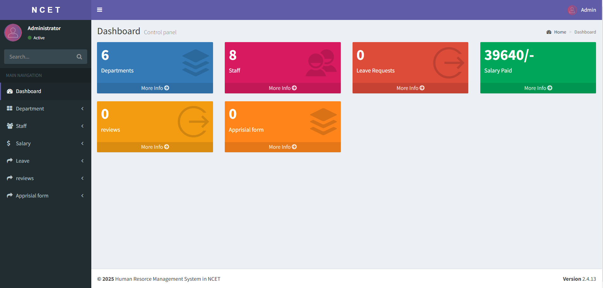

---

### ➕ Add Staff
Form to register new staff members with department and role details.
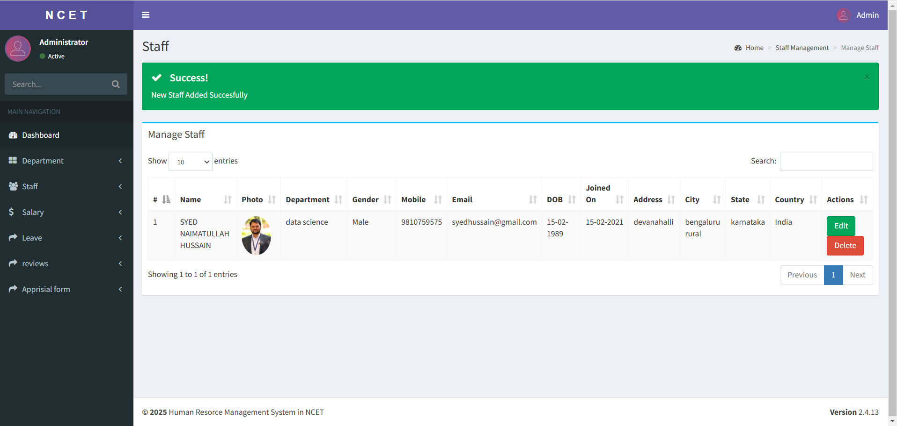

---

### 💰 Admin Salary Management
Admin panel to manage salaries, view slips, and generate reports.
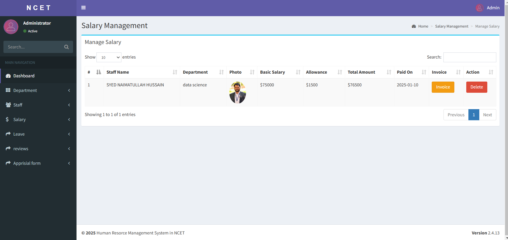

---

### 🏢 Department Management
Create, edit, and delete departments within the organization.
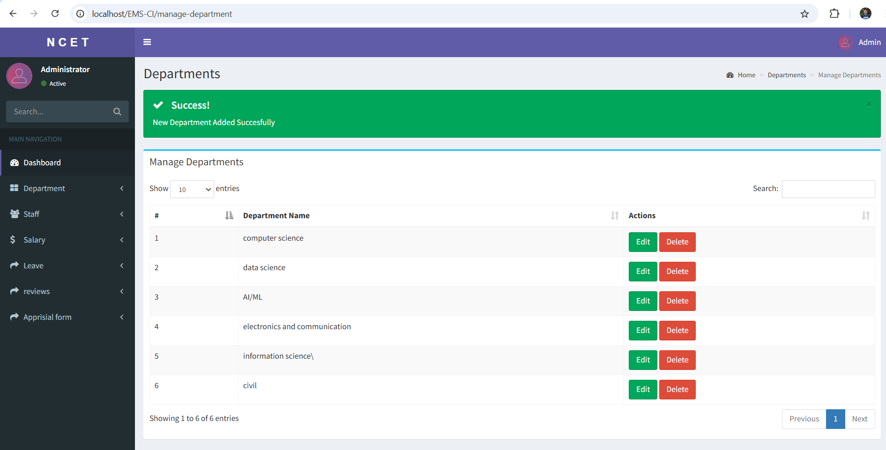

---

### 📄 Invoice Page
Generate and manage staff payment invoices.
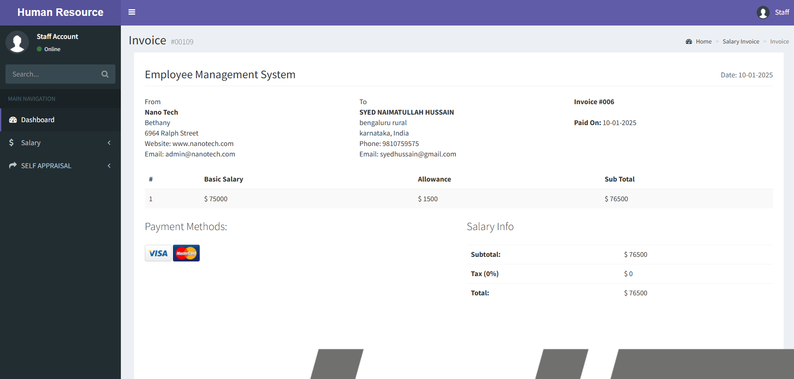

---

### 🧑‍💼 Manage Departments
View and control all existing departments.
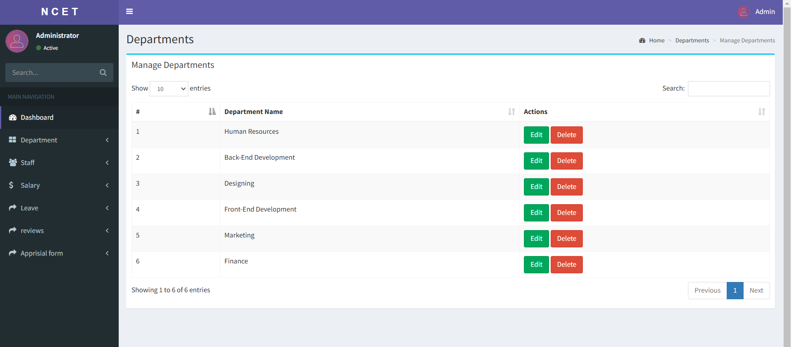

---

### 💼 Salary Management
Manage employee salary details and payment history.
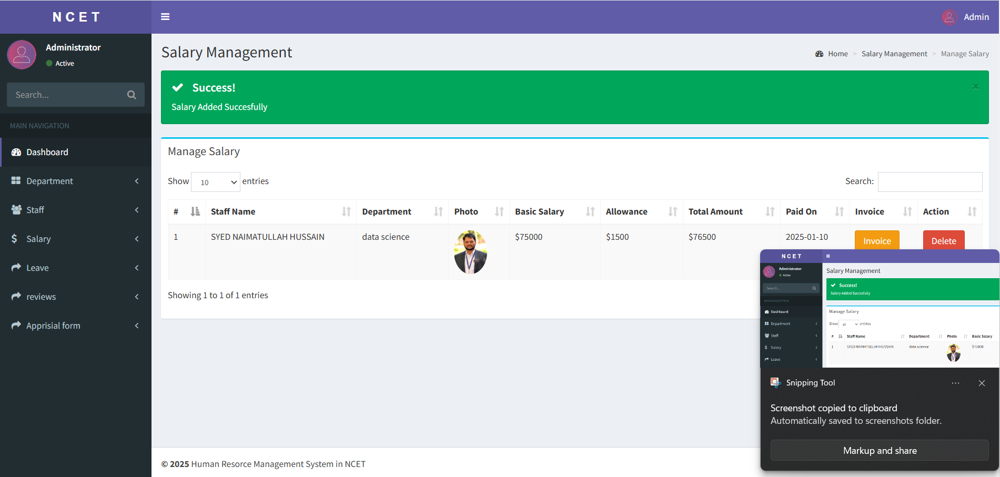

---

### 📑 Salary Slip
View detailed salary slip for individual employees with breakdowns.
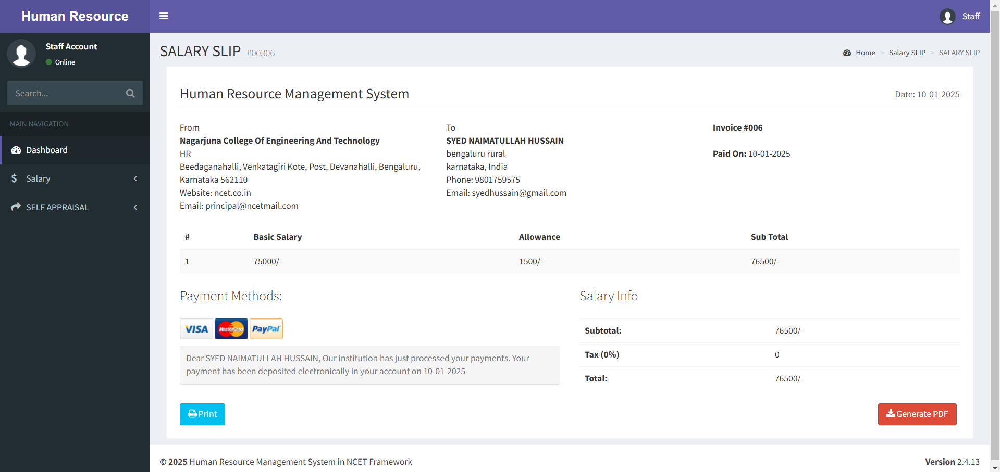

---

### 📊 Self Appraisal
Employees can self-assess and submit appraisal reports.
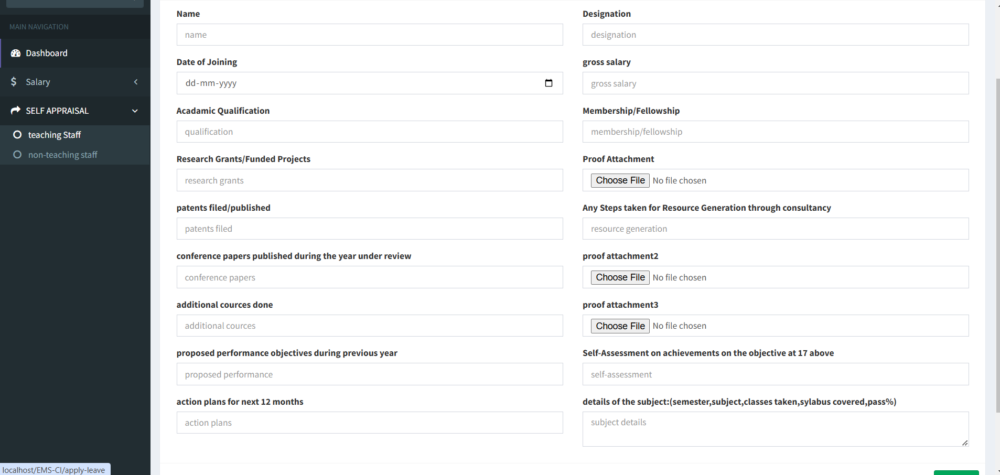

---

### 👨‍💻 Staff Dashboard
Overview panel for staff with access to their details and tools.
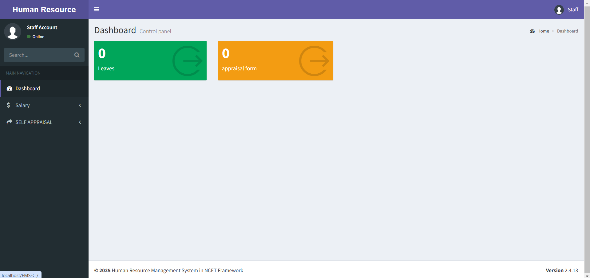

---

### 👥 Staff Management
Admin panel to edit, update, or delete staff records.
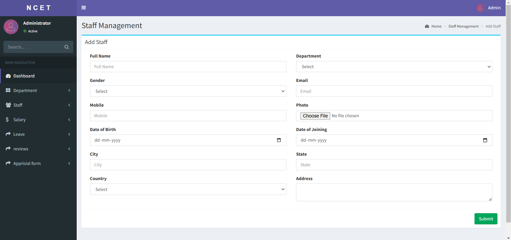

---


## 🔐 Default Login Details

Refer to the `01 LOGIN DETAILS & PROJECT INFO.txt` file for admin/user credentials.

---

## 📄 License

This project is for educational or demonstration use only.

---

## 🙋‍♂️ Author

**Vinay Kumar**  
[GitHub Profile](https://github.com/vinaykumar-1nc22cd062)
